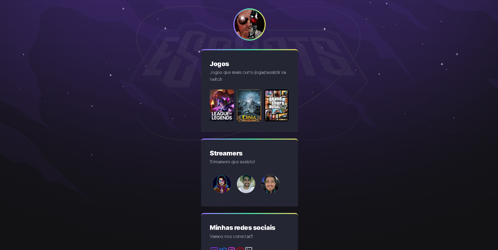
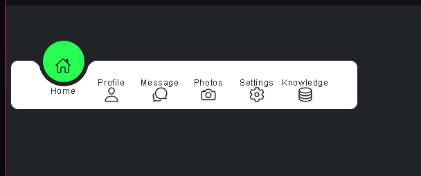

# Estudos-Front

* HTML
* CSS
* JavaScript

_____________________________________________________________________________________________________

# PROJETOS

## NLW eSports
### Trilha Explorer

### Tecnologias utilizadas
* HTML
* CSS
* Git e Github
* Swiper 
    * [Link da biblioteca](https://swiperjs.com/demos)

### Projeto construído no evento Next Level Week da RocketSeat

[ Clique aqui para acessar o projeto](https://thiagoavelino1990.github.io/Estudos-Front/NLW/NLW-Explorer/)

_____________________________________________________________________________________________________

## Online_tutorials

### Projeto em construção. 

### [Link do tutorial(youtube)](https://www.youtube.com/c/OnlineTutorials4Designers)

[ Clique aqui para acessar o projeto(em construção)](https://thiagoavelino1990.github.io/Estudos-Front/Online_Tutorials/)

_____________________________________________________________________________________________________

